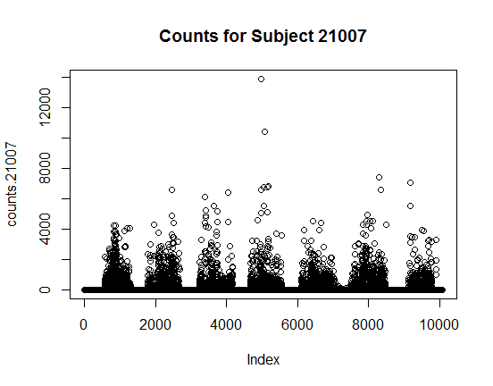
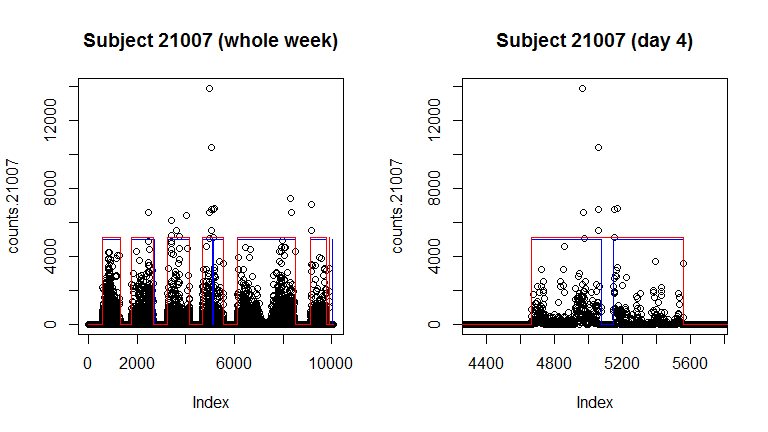

Functions for Processing Accelerometer Data
================
Dane Van Domelen <br> <vandomed@gmail.com>
2018-08-22

<!-- README.md is generated from README.Rmd. Please edit that file -->
Introduction
------------

The **accelerometry** package has functions for processing time series accelerometer data from research studies. It was primarily developed for uniaxial minute-to-minute count data. It is also compatible with triaxial data, and could potentially also be used with epochs other than 1 minute.

If you have "raw data," meaning your device recorded actual acceleration data at 30 Hz or some other sampling frequency, this package probably won't be very helpful. Then again, you can usually convert raw data to counts after data collection, e.g. using [ActiLife software](https://www.actigraphcorp.com/support/software/actilife/) for ActiGraph devices.

C++ is used for most of the functions, through the **Rcpp** package (Eddelbuettel and François 2011), so they should be pretty fast. For example, the **nhanesaccel** package, which relies on **accelerometry**'s functions to process data from the 2003-2006 National Health and Nutrition Examination Survey (NHANES), can process that dataset about 90 times faster than a SAS script provided by the National Cancer Institute (Van Domelen and Pittard 2014).

Installation
------------

The package is available to download from either CRAN or GitHub. To install from CRAN:

``` r
install.packages("accelerometry")
```

And to install from GitHub (**devtools** package must be installed):

``` r
library("devtools")
install_github("vandomed/accelerometry")
```

Typical usage
-------------

Converting time series accelerometer data to meaningful physical activity variables typically requires 3 steps:

1.  Identify periods in which the accelerometer was removed (assuming it could be removed), and determine which days have sufficient wear time.
2.  Calculate physical activity variables of interest for each day.
3.  Calculate averages across valid days, and perhaps for weekdays/weekends separately.

In using the **accelerometry** package, you can either call separate functions to implement these steps (e.g. *nonwear* for 1, *bouts* and *intensities* for 2, and *personvars* for 3) or call an umbrella function that does it all internally (e.g. *process\_uni* or *process\_tri*). The composite functions should be sufficient for most users.

I'll use data from the first 5 subjects in NHANES 2003-2004 (included with the package) to illustrate the various functions. Here's what the dataset looks like:

``` r
head(unidata)
#>       seqn paxday paxinten
#> [1,] 21005      1        0
#> [2,] 21005      1        0
#> [3,] 21005      1        0
#> [4,] 21005      1        0
#> [5,] 21005      1        0
#> [6,] 21005      1        0
dim(unidata)
#> [1] 50400     3
```

There are 3 variables -- `seqn` is the subject ID, `paxday` is the day of the week (1 = Sunday, ..., 7 = Saturday), and `paxinten` is the count value recorded for each minute -- and 50,400 observations (1 obs/min x 1,440 min/day x 7 days/subject x 5 subjects).

Here's what 7 days of data looks like, for the 3rd subject in the dataset, SEQN = 21007. You can see the 7 separate clouds of data corresponding to each day of the week.

``` r
seqn <- unidata[, "seqn"]
counts <- unidata[, "paxinten"]
counts.21007 <- counts[seqn == 21007]
plot(counts.21007, main = "Counts for Subject 21007")
```



Individual functions
--------------------

### `weartime`

There are two distinct approaches for identifying non-wear time:

1.  Have subjects keep a journal, writing down the precise times that they take the device off and put it back on.
2.  Identify non-wear periods based on the accelerometer signal itself, under the assumption that long periods of 0 counts are probably non-wear time.

Approach 2 is seriously flawed, in my opinion, because it is very possible for somebody wearing the device to record 0 counts for several hours consecutively. But this is the only option for studies like NHANES, where journals were not part of the protocol.

The *weartime* function is for implementing the signal-based approach of removing non-wear time. The default behavior is to classify as non-wear any interval 60 minutes or longer with 0 counts. To do that for our subject of interest:

``` r
wear1 <- weartime(counts.21007)
```

If you have reason to prefer a 90- rather than 60-minute window size, and perhaps want to allow for up 2 nonzero count values as long as they are below 100, you could use:

``` r
wear2 <- weartime(counts.21007, 
                  window = 90, 
                  tol = 2, 
                  tol_upper = 99)
```

Let's see how these two compare (multiplying 0/1 vectors by 5000 and 5100 just to make it easier to visualize):

``` r
par(mfrow = c(1, 2))

plot(counts.21007, main = "Subject 21007 (whole week)")
points(wear1 * 5000, type = "l", col = "blue")
points(wear2 * 5100, type = "l", col = "red")

plot(counts.21007, xlim = c(4321, 5760), main = "Subject 21007 (day 4)")
points(wear1 * 5000, type = "l", col = "blue")
points(wear2 * 5100, type = "l", col = "red")
```



It looks like the main difference here is an extra non-wear period for the 60-minute method on the 4th day of monitoring. Personally, I wouldn't go higher than 60 minutes. Even at 60, you'll have no chance of removing short non-wear periods, e.g. when subjects are showering or swimming for exercise. That's all going to be classified as sedentary time, unfortunately.

### `bouts`

A "bout" is a sustained period of activity of some intensity for some time. Bouted MVPA (moderate-to-vigorous physical activity) is a popular bout variable because physical activity guidelines are often based on MVPA accumulated in bouts of &gt;= 10 minutes (Troiano et al. 2008). Bouted sedentary time can also be interesting, given recent enthusiasm for studying sedentary behaviors.

Here is how you would use *bouts* to identify bouted MVPA for our subject of interest. Note that 2020 is a common cutpoint used to classify MVPA (Troiano et al. 2008).

``` r
mvpa <- bouts(counts = counts.21007, 
              bout_length = 10, 
              thresh_lower = 2020)
sum(mvpa)
#> [1] 0
```

Zero bouted MVPA for the entire week - not good! That's actually not uncommon in NHANES. And we're using a strict definition of a bout, not allowing for any minutes to dip below 2020 counts during a 10-minute window. We could be more liberal and define bouted MVPA as any 10-minute interval with counts ≥ 2020, allowing for 1-2 minutes with counts &lt; 2020, as long as they are still ≥ 100. To implement that algorithm:

``` r
mvpa <- bouts(counts = counts.21007, 
              bout_length = 10, 
              thresh_lower = 2020, 
              tol = 2, 
              tol_lower = 100)
sum(mvpa)
#> [1] 10075
```

With this more forgiving algorithm, the subject is considered to have 21 rather than 0 minutes of bouted MVPA over the course of the week.

### `intensities`

This is a simple function that calculates the number of minutes spent in 5 different intensity levels, and the number of counts accumulated from each intensity level. Default behavior is to categorize counts as follows:

-   0-99 = intensity 1 (sedentary)
-   100-759 = intensity 2 (light)
-   760-2019 = intensity 3 (lifestyle)
-   2020-5998 = intensity 4 (moderate)
-   ≥ 5999 = intensity 5 (vigorous)

It also lumps intensities 2-3, 4-5, and 2-5 together, for a total of 8 categories. Applied to our subject:

``` r
(intensity.data <- intensities(counts = counts.21007[wear1 == 1]))
#>  [1]    3379    2069     790     247      12    2859     259    3118
#>  [9]   62933  702722  953350  717948   91473 1656072  809421 2465493
```

I subsetted just the valid wear time for this subject, to avoid classifying non-wear time as sedentary time. The first 8 numbers are time spent in the various intensities (e.g. 3379 minutes of sedentary time), and the next 8 are counts accumulated from those intensities (e.g. 62933 counts accumulated during sedentary time).

### `sedbreaks`

There is some evidence in the epidemiological literature that "sedentary breaks" are beneficial (Stamatakis et al. 2018), i.e. that breaking up prolonged periods of sedentary time can lead to improved health. To count the number of sedentary breaks over the 7-day period for our subject of interest:

``` r
breakcount <- sedbreaks(counts = counts.21007, 
                        weartime = wear1)
sum(breakcount)
#> [1] 729
```

This subject had 729 sedentary breaks over the 7-day period, or a little more than 100 a day. The definition of a sedentary break here is having a minute with counts ≥ 100 after a minute of counts &lt; 100. Note that we had to give *sedbreaks* the wear time vector; this prevents the first minute after each non-wear periods being classified as a sedentary break.

Umbrella functions
------------------

### `process_uni`

With uniaxial accelerometer data, you can use *process\_uni* to calculate physical activity variables for each subject. To calculate a few basic activity variables for our subject of interest, you can run:

``` r
(averages.21007 <- process_uni(counts.21007))
#>      id valid_days valid_wk_days valid_we_days include valid_min   counts
#> [1,]  1          7             5             2       1  928.1429 361203.7
#>          cpm steps
#> [1,] 402.281   NaN
```

It looks like all 7 days were valid for analysis, meaning they had at least 10 hours of wear time. The subject averaged about 928 minutes (15.5 hours) of wear time per day. The variables `counts` and `cpm` (counts per minute of wear time) are probably the two most popular measures of total physical activity volume; this subject averaged about 361,000 counts per day, and 402.3 counts per minute of wear time.

All we specified was the vector of counts, so the function used default values for everything, which basically means the data-processing parameters that I personally prefer. But if you look at the help file (`?process_uni`), you'll see a long list of parameters that you can adjust if you like.

Oftentimes researchers want more detailed variables than just counts and cpm. You can request a lot more variables with the `brevity` input. If we set it to 2 rather than 1:

``` r
averages.21007 <- process_uni(counts = counts.21007, 
                              brevity = 2)
colnames(averages.21007)
#>  [1] "id"                "valid_days"        "valid_wk_days"    
#>  [4] "valid_we_days"     "include"           "valid_min"        
#>  [7] "counts"            "cpm"               "steps"            
#> [10] "sed_min"           "light_min"         "life_min"         
#> [13] "mod_min"           "vig_min"           "lightlife_min"    
#> [16] "mvpa_min"          "active_min"        "sed_percent"      
#> [19] "light_percent"     "life_percent"      "mod_percent"      
#> [22] "vig_percent"       "lightlife_percent" "mvpa_percent"     
#> [25] "active_percent"    "sed_counts"        "light_counts"     
#> [28] "life_counts"       "mod_counts"        "vig_counts"       
#> [31] "lightlife_counts"  "mvpa_counts"       "active_counts"    
#> [34] "sed_bouted_10min"  "sed_bouted_30min"  "sed_bouted_60min" 
#> [37] "sed_breaks"        "max_1min_counts"   "max_50min_counts" 
#> [40] "max_10min_counts"  "max_30min_counts"  "num_mvpa_bouts"   
#> [43] "num_vig_bouts"     "mvpa_bouted"       "vig_bouted"       
#> [46] "guideline_min"
```

Now we get a lot more variables, with various measures of intensity, sedentary behaviors, and bouted activity. Let's look at a few of the variables:

``` r
averages.21007[, c("sed_percent", "sed_bouted_60min", "max_1min_counts")]
#>      sed_percent sed_bouted_60min  max_1min_counts 
#>        0.5035413       52.4285714     7173.2857143
```

The subject on average spent 50.4% of wear time sedentary, 570.7 minutes per day in sedentary bouts ≥ 1 hour, and achieved a max 5-minute count average of 3371 counts/min.

If you set `brevity = 3`, you also get hourly count averages, which can be interesting to plot for individual subjects and/or across subgroups.

If you want a daily summary rather than averages across all valid days, you can set `return_form = "daily"`.

``` r
(daily.21007 <- process_uni(counts = counts.21007, 
                            return_form = "daily"))
#>      id day valid_day valid_min counts      cpm steps
#> [1,]  1   1         1       737 438907 595.5319    NA
#> [2,]  1   2         1       953 400517 420.2697    NA
#> [3,]  1   3         1       941 316556 336.4038    NA
#> [4,]  1   4         1       826 386072 467.3995    NA
#> [5,]  1   5         1      1098 293143 266.9791    NA
#> [6,]  1   6         1      1284 437497 340.7298    NA
#> [7,]  1   7         1       658 255734 388.6535    NA
```

### `process_tri`

This function is very similar to *process\_uni*, but works on triaxial rather than uniaxial accelerometer data. To illustrate, we can use the `tridata` dataset included with the package:

``` r
head(tridata)
#>      vert ap ml
#> [1,]    0  0  0
#> [2,]    0  0  0
#> [3,]    0  0  0
#> [4,]    0  0  0
#> [5,]    0  0  0
#> [6,]    0  0  0
```

This is not real data and doesn't closely resemble real data; I generated it as 0's from midnight to 8 am and then multivariate normal for the rest of the day. The 3 columns are intended to represent counts in 3 axes: vertical, anteroposterior (AP), and mediolateral (ML).

Let's see what happens when we run *process\_tri*:

``` r
(daily.tri <- process_tri(tridata))
#>      id day valid_day valid_min counts_vert counts_ap counts_ml counts_sum
#> [1,]  1   1         1       959     1544623   1529602   1522205    4596430
#> [2,]  1   2         1       959     1590602   1588969   1572505    4752076
#> [3,]  1   3         1       960     1524408   1514676   1598054    4637138
#> [4,]  1   4         1       960     1522137   1510912   1555942    4588991
#> [5,]  1   5         1       960     1534686   1547806   1522350    4604842
#> [6,]  1   6         1       959     1528161   1503414   1535805    4567380
#> [7,]  1   7         1       960     1556011   1538843   1569277    4664131
#>      counts_vm cpm_vert   cpm_ap   cpm_ml  cpm_sum   cpm_vm steps
#> [1,]   3153402 1610.660 1594.997 1587.284 4792.941 3288.219    NA
#> [2,]   3247601 1658.605 1656.902 1639.734 4955.241 3386.445    NA
#> [3,]   3169986 1587.925 1577.787 1664.640 4830.352 3302.068    NA
#> [4,]   3149399 1585.559 1573.867 1620.773 4780.199 3280.624    NA
#> [5,]   3179197 1598.631 1612.298 1585.781 4796.710 3311.663    NA
#> [6,]   3137262 1593.494 1567.689 1601.465 4762.649 3271.389    NA
#> [7,]   3210668 1620.845 1602.961 1634.664 4858.470 3344.446    NA
```

Results are similar to what *process\_uni* produced, but instead of a single `counts` and `cpm` variable for each day, we have 5: one for each axis of the accelerometer, plus one for the triaxial sum and one for the triaxial vector magnitude.

I won't give a full tutorial here, but to illustrate adjusting data-processing parameters, suppose we wanted to define non-wear time as 45 minutes of 0 counts in all 3 axes, as opposed to 60 minutes of 0 counts in the vertical axis only. You would run:

``` r
(daily.tri <- process_tri(counts = tridata, 
                          nonwear_axis = "sum", 
                          nonwear_window = 45))
#>      id day valid_day valid_min counts_vert counts_ap counts_ml counts_sum
#> [1,]  1   1         1       960     1544623   1531284   1522205    4598112
#> [2,]  1   2         1       960     1590602   1588969   1574682    4754253
#> [3,]  1   3         1       960     1524408   1514676   1598054    4637138
#> [4,]  1   4         1       960     1522137   1510912   1555942    4588991
#> [5,]  1   5         1       960     1534686   1547806   1522350    4604842
#> [6,]  1   6         1       960     1528161   1506124   1539040    4573325
#> [7,]  1   7         1       960     1556011   1538843   1569277    4664131
#>      counts_vm cpm_vert   cpm_ap   cpm_ml  cpm_sum   cpm_vm steps
#> [1,]   3155084 1608.982 1595.088 1585.630 4789.700 3286.546    NA
#> [2,]   3249778 1656.877 1655.176 1640.294 4952.347 3385.185    NA
#> [3,]   3169986 1587.925 1577.787 1664.640 4830.352 3302.068    NA
#> [4,]   3149399 1585.559 1573.867 1620.773 4780.199 3280.624    NA
#> [5,]   3179197 1598.631 1612.298 1585.781 4796.710 3311.663    NA
#> [6,]   3141482 1591.834 1568.879 1603.167 4763.880 3272.378    NA
#> [7,]   3210668 1620.845 1602.961 1634.664 4858.470 3344.446    NA
```

References
----------

Eddelbuettel, Dirk. 2013. *Seamless R and C++ Integration with Rcpp*. New York: Springer. doi:[10.1007/978-1-4614-6868-4](https://doi.org/10.1007/978-1-4614-6868-4).

Eddelbuettel, Dirk, and James Joseph Balamuta. 2017. “Extending R with C++: A Brief Introduction to Rcpp.” *PeerJ Preprints* 5 (August): e3188v1. doi:[10.7287/peerj.preprints.3188v1](https://doi.org/10.7287/peerj.preprints.3188v1).

Eddelbuettel, Dirk, and Romain François. 2011. “Rcpp: Seamless R and C++ Integration.” *Journal of Statistical Software* 40 (8): 1–18. doi:[10.18637/jss.v040.i08](https://doi.org/10.18637/jss.v040.i08).

Stamatakis, Emmanuel, Ulf Ekelund, Ding Ding, Mark Hamer, Adrian E Bauman, and I-Min Lee. 2018. “Is the Time Right for Quantitative Public Health Guidelines on Sitting? A Narrative Review of Sedentary Behaviour Research Paradigms and Findings.” *Br J Sports Med*. BMJ Publishing Group Ltd; British Association of Sport; Exercise Medicine, bjsports–2018.

Troiano, Richard P, David Berrigan, Kevin W Dodd, Louise C Masse, Timothy Tilert, Margaret McDowell, and others. 2008. “Physical Activity in the United States Measured by Accelerometer.” *Medicine and Science in Sports and Exercise* 40 (1). WILLIAMS & WILKINS: 181.

Van Domelen, Dane, and W. Stephen Pittard. 2014. “Flexible R Functions for Processing Accelerometer Data, with Emphasis on Nhanes 2003-2006.” *The R Journal* 6 (2). <https://journal.r-project.org/archive/2014/RJ-2014-024/RJ-2014-024.pdf>.
